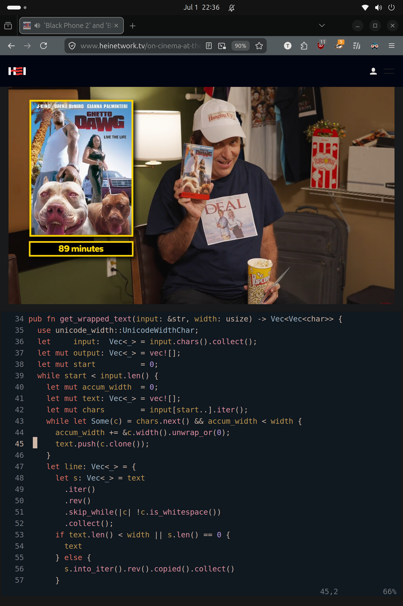
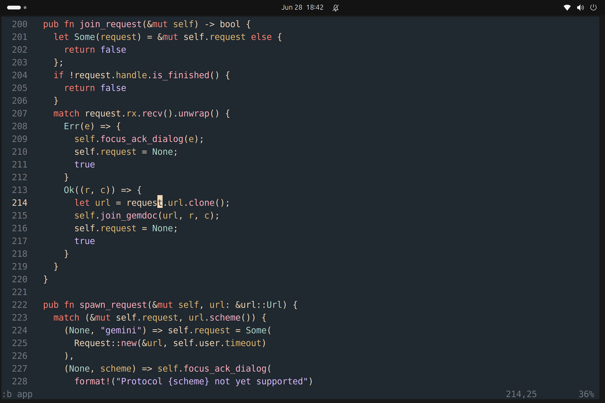

# neovim plugins

## Use
- copy ./pack/tsad into your config runtime directory (typically ~/.config/nvim)
- reference init.lua for how to enable each plugin

## Dependencies
- If you use the LSP settings, make sure LSP libraries are located somewhere in your $PATH

## Colorschemes

### magic

### glowingoceanfloor

